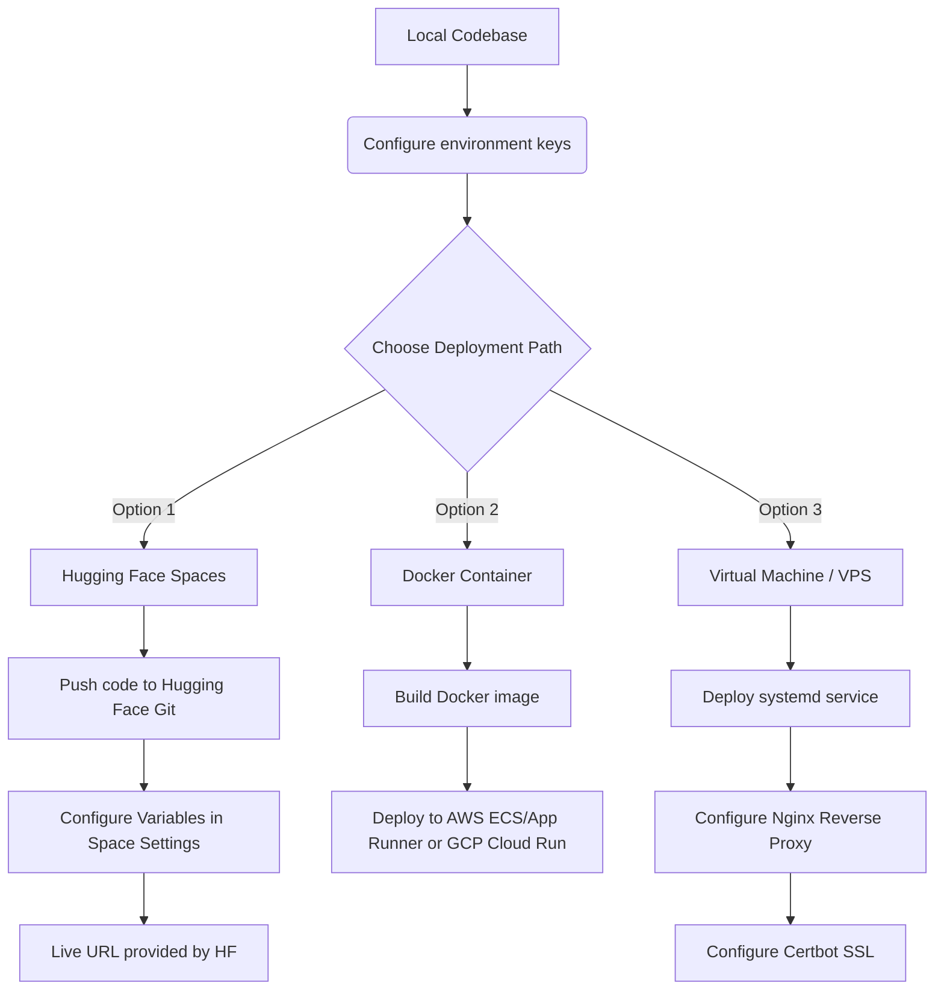

# Resume Screening & ATS Scoring Platform

An advanced, production-ready AI-powered Candidate Screening, Semantic Resume Search (RAG), and Conversational ReAct Recruiter Agent platform. The system parses PDF and Word resumes, embeds and indexes candidate details in a local FAISS database, and performs weight-based applicant tracking evaluations using LLMs (OpenAI, Gemini, and Groq).

---

## 👥 Target Audience & Key Benefits

This platform is designed to streamline the recruitment process by bridging the gap between candidates and job descriptions.

### 1. For Recruiters & Talent Acquisition (Primary Users)
*   **Time Savings**: Review and rank hundreds of resumes in seconds instead of hours.
*   **Weighted Leaderboard**: Custom-weight the evaluation parameters (Skills, Experience, Education, Certifications) to match specific role criteria and rank candidates instantly.
*   **Semantic RAG Queries**: Ask natural language questions like *"Who has experience building CI/CD pipelines?"* or *"List candidates with 3+ years of Kubernetes experience."*
*   **Conversational Assistant**: Chat with an AI Recruiter Agent that has access to local databases and scoring tools to inspect individual candidates or compare profiles.

### 2. For Job Seekers & Candidates (Self-Assessment)
*   **ATS Optimization**: Benchmark your resume against target job descriptions before applying.
*   **Detailed Improvement Feedback**: Receive actionable recommendations from the LLM regarding missing skills, professional experience phrasing, and certifications to improve matching scores.

---

## 🛠️ Technology Stack

*   **UI Framework**: [Gradio](https://gradio.app/) (utilizing modern Messages API and responsive custom CSS)
*   **AI/Orchestration**: [LangChain](https://www.langchain.com/) (LangChain-Community, LangChain-OpenAI, LangChain-GoogleGenAI, LangChain-Groq)
*   **RAG Vector Database**: [FAISS](https://github.com/facebookresearch/faiss) (file-based, running locally in-memory)
*   **Embeddings**: HuggingFace Local Embeddings (`sentence-transformers`) or OpenAI Embeddings
*   **Parsers**: `pdfplumber` / `pypdf` (PDF), `python-docx` (Word documents)
*   **Charts & Visuals**: `matplotlib` & `numpy` (horizontal category breakdown bar charts)

---

## 📂 Project Structure

```text
├── resume_ats_agent/
│   ├── agents/          # ReAct Agent Manager & custom agent tools
│   ├── config/          # Configurations & settings singleton
│   ├── core/            # Logging utilities & custom exception classes
│   ├── engine/          # ATS evaluation & LLM parsing logic
│   ├── models/          # Pydantic data schemas
│   ├── parsers/         # PDF and Word document extraction strategies
│   ├── rag/             # Embedding factory & local FAISS manager
│   ├── ui/              # Gradio web app interface
│   └── facade.py        # System coordinator (Facade pattern)
├── TestScripts/         # Diagnostic test scripts
├── data/                # Local database folder for FAISS indexes
├── logs/                # Local runtime logs
├── main.py              # Application entrypoint
├── requirements.txt     # Python dependencies
└── .env                 # Application environment configurations (generated dynamically)
```

---

## 🚀 Local Installation & Setup

### Prerequisites
*   Python 3.10 or higher
*   Pip (Python Package Manager)

### Step 1: Clone the Repository
```bash
git clone <repository-url>
cd resume-screening-ats-platform
```

### Step 2: Set Up a Virtual Environment
```bash
# Windows
python -m venv venv
.\venv\Scripts\activate

# macOS / Linux
python3 -m venv venv
source venv/bin/activate
```

### Step 3: Install Dependencies
```bash
pip install -r requirements.txt
```

### Step 4: Configure Environment Variables
Copy `.env.example` to `.env` or run the application directly to let the UI write it for you:
```bash
# Example .env configuration
DEFAULT_LLM_PROVIDER=openai
DEFAULT_MODEL_NAME=gpt-4o
OPENAI_API_KEY=your_openai_key_here
EMBEDDING_PROVIDER=huggingface
EMBEDDING_MODEL_NAME=sentence-transformers/all-MiniLM-L6-v2
VECTOR_DB_DIR=./data/vector_db
LOG_LEVEL=INFO
```

### Step 5: Run the Application
```bash
python main.py
```
Open your browser and navigate to `http://127.0.0.1:7860`.

---

## 🌐 Deployment Roadmap

Here is the end-to-end guide to deploying this application to staging and production environments.



### Option A: Hugging Face Spaces (Easiest, Free Hosting)
Hugging Face Spaces supports Gradio natively out-of-the-box.
1.  Create a Hugging Face account and create a new **Space**.
2.  Choose **Gradio** as the Space SDK and select a hardware tier (the free CPU basic tier works perfectly with local HuggingFace embeddings).
3.  Clone the Space repository locally or link it to your GitHub repository.
4.  In the Space **Settings** panel, configure your API secrets (e.g., `OPENAI_API_KEY`, `GEMINI_API_KEY`, etc.) as **Repository Secrets**.
5.  Push your code to the Hugging Face space repository. Hugging Face will automatically read `requirements.txt` and serve the Gradio UI at a public URL.

### Option B: Docker Container Deployment (Production-Grade)
1.  Create a `Dockerfile` in the root directory:
    ```dockerfile
    FROM python:3.10-slim
    
    WORKDIR /app
    
    # Install system level packages
    RUN apt-get update && apt-get install -y --no-install-recommends \
        build-essential \
        && rm -rf /var/lib/apt/lists/*
        
    COPY requirements.txt .
    RUN pip install --no-cache-dir -r requirements.txt
    
    COPY . .
    
    EXPOSE 7860
    
    # Launch Gradio on 0.0.0.0 to allow external connections
    CMD ["python", "main.py"]
    ```
2.  Build and run your container locally:
    ```bash
    docker build -t resume-ats-app .
    docker run -p 7860:7860 --env-file .env resume-ats-app
    ```
3.  Deploy the built image to cloud platforms:
    *   **Google Cloud Run**: Push the image to GCP Artifact Registry and run serverless.
    *   **AWS ECS / App Runner**: Push the image to Amazon ECR and run using Fargate or App Runner.

### Option C: VPS / Virtual Machine Deployment (DigitalOcean, AWS EC2, Linode)
1.  Spin up an Ubuntu LTS instance and install `python3-pip`, `python3-venv`, and `nginx`.
2.  Clone the repository under `/var/www/resume-ats-app`.
3.  Create a Virtual Environment, install requirements, and create your `.env` file.
4.  Set up the app as a systemd service under `/etc/systemd/system/resume-ats.service`:
    ```ini
    [Unit]
    Description=Gradio Resume ATS Application
    After=network.target

    [Service]
    User=ubuntu
    WorkingDirectory=/var/www/resume-ats-app
    ExecStart=/var/www/resume-ats-app/venv/bin/python main.py
    Restart=always

    [Environment]=PATH=/var/www/resume-ats-app/venv/bin:/usr/bin:/usr/local/bin

    [Install]
    WantedBy=multi-user.target
    ```
5.  Enable and start the service:
    ```bash
    sudo systemctl daemon-reload
    sudo systemctl enable resume-ats.service
    sudo systemctl start resume-ats.service
    ```
6.  Configure Nginx as a reverse proxy under `/etc/nginx/sites-available/default`:
    ```nginx
    server {
        listen 80;
        server_name yourdomain.com;

        location / {
            proxy_pass http://127.0.0.1:7860;
            proxy_http_version 1.1;
            proxy_set_header Upgrade $http_upgrade;
            proxy_set_header Connection "upgrade";
            proxy_set_header Host $host;
            proxy_set_header X-Real-IP $remote_addr;
            proxy_set_header X-Forwarded-For $proxy_add_x_forwarded_for;
            proxy_set_header X-Forwarded-Proto $scheme;
        }
    }
    ```
7.  Run `sudo certbot --nginx -d yourdomain.com` to provision a Let's Encrypt SSL certificate.

---

## 📐 Design Patterns Implemented
*   **Facade Pattern (`facade.py`)**: Consolidates complex sub-system initializations (parser factories, scoring strategy, vector database, agent executor) into a simple, high-level interface.
*   **Strategy Pattern (`parsers/`)**: `BaseResumeParser` defines an interface, and `PDFParser` and `DocxParser` implement concrete parsing algorithms chosen at runtime.
*   **Factory Pattern (`parsers/factory.py`, `rag/embedding_service.py`)**: Instantiates parsers and embedding models based on file extensions or configuration settings.
*   **Singleton Pattern (`config/settings.py`)**: Ensures configurations and environment setups are loaded once and shared globally.
